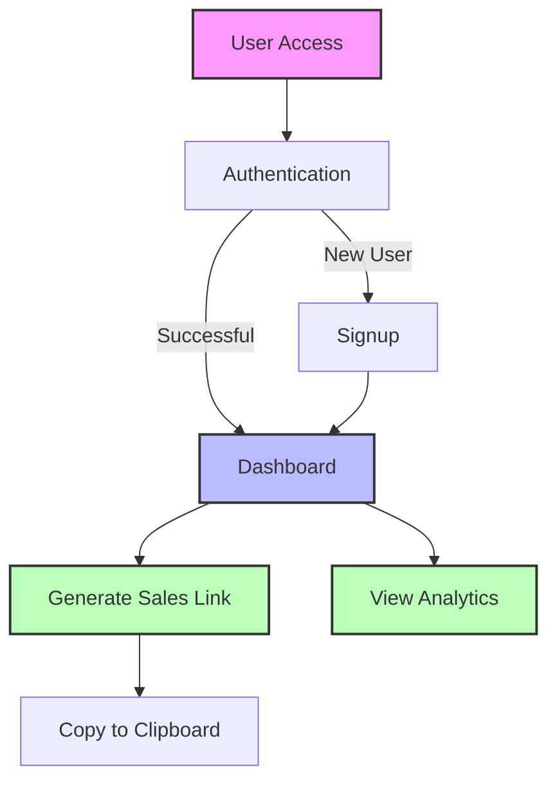
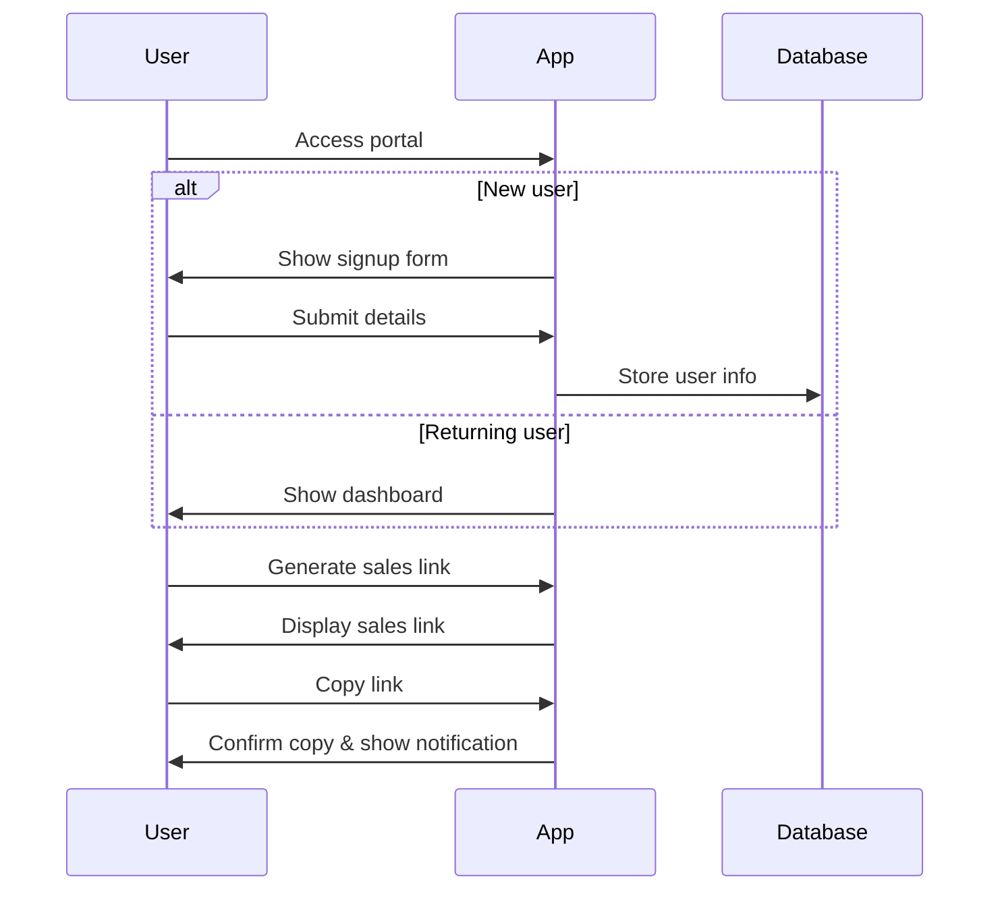

# LVL3.ai Sales Portal

A streamlined web application for LVL3.ai affiliates to generate and manage sales links.

## Features

- User signup/authentication
- Sales link generation
- Dashboard with analytics
- Copy-to-clipboard functionality
- Responsive design for all devices

## Architecture



## User Flow



## Installation

```bash
# Clone the repository
git clone https://github.com/yourusername/lvl3_affiliate_2.git

# Navigate to project directory
cd lvl3_affiliate_2

# Open in browser
open index.html
```

## Development

This project is built with vanilla HTML, CSS, and JavaScript. No build process is required for development.

To modify the application:

1. Edit `index.html` to update the UI and functionality
2. Test locally by opening the HTML file in a browser

## Deployment to Vercel

### Prerequisites

1. [Vercel account](https://vercel.com/signup)
2. [Vercel CLI](https://vercel.com/download) (optional for command line deployment)

### Deploy Steps

#### Option 1: Using Vercel Dashboard

1. Login to [Vercel](https://vercel.com/)
2. Click "New Project"
3. Import your Git repository or upload the project files
4. Configure project settings (no special configuration needed for this project)
5. Deploy

#### Option 2: Using Vercel CLI

```bash
# Install Vercel CLI if not installed
npm install -g vercel

# Login to Vercel
vercel login

# Deploy from project directory
cd lvl3_affiliate_2
vercel
```

## License

MIT License

## About

LVL3.ai Sales Portal is a lightweight, fast-loading application designed to help affiliates generate and track sales links efficiently.
