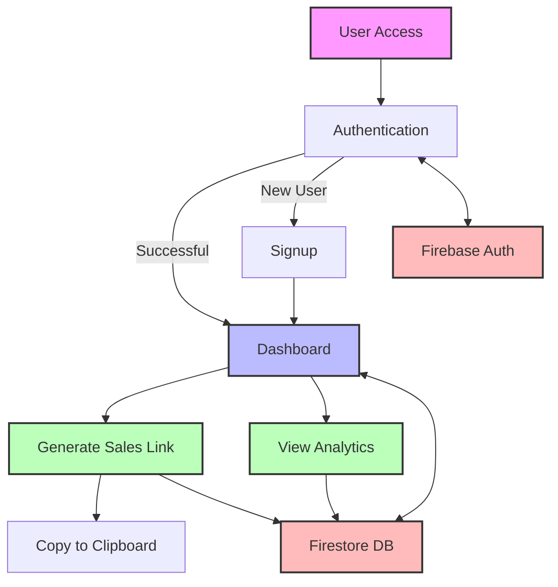
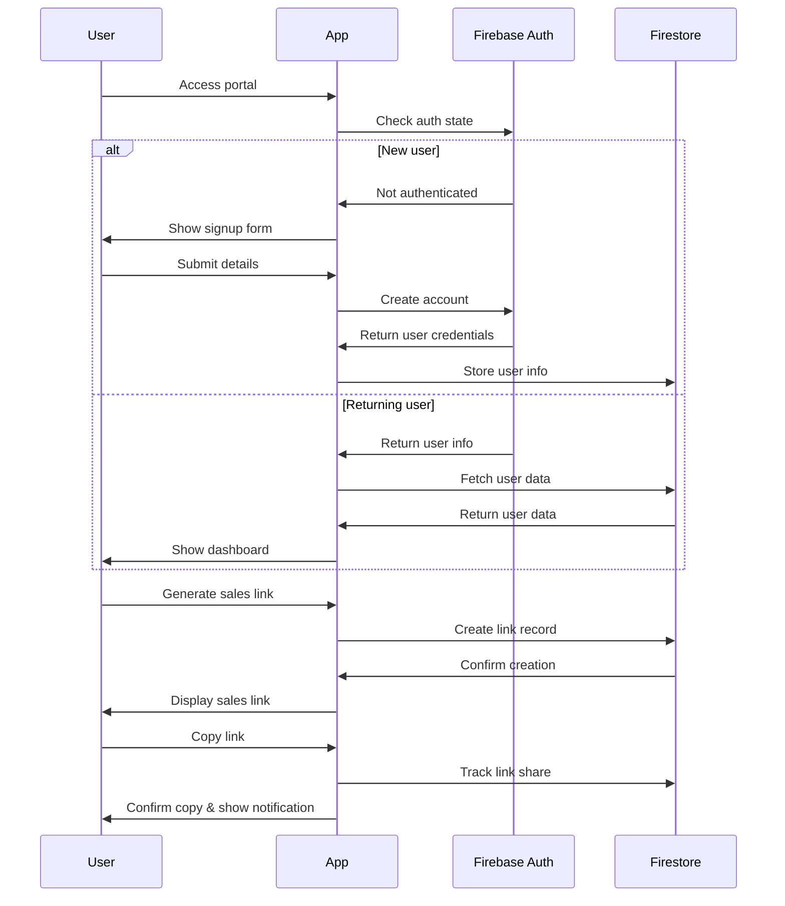

# LVL3.ai Sales Portal

A full-stack web application for LVL3.ai affiliates to generate and manage sales links with Firebase backend integration. The portal allows users to earn $5 per signup with a maximum of 500 signups ($2,500 maximum earnings).

## Features

- User signup/authentication with Firebase Auth
- Secure sales link generation and tracking
- Real-time dashboard with analytics
- Firestore database integration
- Copy-to-clipboard functionality
- Mock mode for development without API keys
- Responsive design for all devices

## Architecture



## User Flow



## Installation

```bash
# Clone the repository
git clone https://github.com/SpencerBrown1717/lvl3_affiliate_2.git

# Navigate to project directory
cd lvl3_affiliate_2

# Install dependencies
npm install

# Set up Firebase (optional)
# 1. Create a Firebase project at https://console.firebase.google.com/
# 2. Enable Authentication and Firestore
# 3. Update firebase.config.js with your Firebase credentials

# Run development server
npm run dev
```

## Development

This project uses a hybrid approach with vanilla HTML/CSS/JS for the frontend and Firebase for the backend services.

### Project Structure

```
├── index.html        # Main application HTML/CSS/JS
├── firebase.js      # Firebase initialization with defensive coding
├── firebase.config.js # Firebase configuration (excluded from git)
├── auth.js          # Firebase Authentication functions
├── salesLinks.js    # Sales link generation and analytics functions
├── package.json     # Project dependencies and scripts
├── vercel.json      # Vercel deployment configuration
└── README.md        # Project documentation
```

### Mock Mode

The application includes a mock mode that activates when Firebase credentials are missing or invalid. This allows development and testing without requiring actual Firebase credentials.

### Development Workflow

1. Clone the repository
2. Install dependencies with `npm install`
3. Run the development server with `npm run dev` 
4. Modify files as needed
5. Test changes locally

## Deployment to Vercel

### Prerequisites

1. [Vercel account](https://vercel.com/signup)
2. [Firebase project](https://console.firebase.google.com/) (optional but recommended for full functionality)

### Deploy Steps

#### Option 1: Using Vercel Dashboard

1. Login to [Vercel](https://vercel.com/)
2. Click "New Project"
3. Import your Git repository or upload the project files
4. Configure project settings:
   - Framework Preset: Other
   - Build Command: `npm run build`
   - Output Directory: `.` (root)
   - Install Command: `npm install`
5. Add environment variables for Firebase (optional):
   - FIREBASE_API_KEY
   - FIREBASE_AUTH_DOMAIN
   - FIREBASE_PROJECT_ID
   - FIREBASE_STORAGE_BUCKET
   - FIREBASE_MESSAGING_SENDER_ID
   - FIREBASE_APP_ID
6. Deploy

#### Option 2: Using Vercel CLI

```bash
# Install Vercel CLI if not installed
npm install -g vercel

# Login to Vercel
vercel login

# Deploy to production
vercel --prod
```

### Live Demo

The application is deployed at: [https://lvl3-sales-portal.windsurf.build](https://lvl3-sales-portal.windsurf.build)


## About

LVL3.ai Sales Portal is a lightweight, fast-loading application designed to help affiliates generate and track sales links efficiently.
